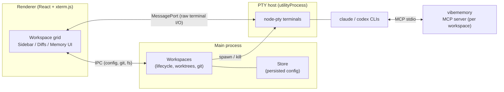

# VibeTerminal

**A multi-agent terminal workspace manager for macOS.**

Run several AI coding agents — Claude Code, Codex, or plain shells — side by side in one native window. Each agent can work in its own isolated git worktree, so parallel agents never step on each other's changes. Workspaces persist across restarts, and every agent shares a searchable project memory.

[](https://github.com/Andriy22/VibeTerminal/actions/workflows/ci.yml)
[](https://github.com/Andriy22/VibeTerminal/releases/latest)


> 🎬 Demo video and screenshots coming soon.

## Why VibeTerminal?

Working with AI coding agents quickly turns into a pile of terminal tabs: one agent refactoring, another writing tests, a shell for git. Tabs hide each other, agents overwrite each other's files, and every restart means re-opening everything by hand.

VibeTerminal treats that whole setup as a single **workspace**: a project folder plus a grid of terminal panes. Launch it once, and the app remembers the layout, relaunches agents with their previous conversations, and keeps each agent's changes isolated until you're ready to merge.

## Features

- **Workspace grid** — put 1–N terminal panes on a project folder, arrange them in an auto or fixed-column grid, and relaunch the whole thing with one click. Workspaces that were running when you quit are restored on the next start.
- **Three pane types** — [Claude Code](https://claude.com/claude-code), [Codex](https://github.com/openai/codex), or a plain shell. Per-workspace CLI flags for each agent, plus a per-pane restart button.
- **Git worktree isolation** — each agent pane gets its own worktree cut from a base branch you choose. Agents work on separate branches in parallel; the built-in diff view shows exactly what each one changed. Multi-repo folders are supported: every agent gets a mirror of the folder with per-repo worktrees under `.agents/<callsign>`.
- **Built-in diff & file views** — review uncommitted changes and committed-but-unmerged work per checkout without leaving the app, with syntax-highlighted diffs and a lightweight file editor.
- **Shared project memory** — a bundled MCP server (`vibememory`) gives every agent persistent, scoped markdown memory: decisions, gotchas, and architecture notes survive between sessions and are shared across agents. Browse and search notes in the app's Memory panel.
- **Session resume** — agents relaunch with their previous conversation (`claude --continue`, `codex resume --last`) instead of starting cold.
- **YOLO mode** — per-workspace toggle that launches agents with permission prompts disabled, for when you trust the sandbox you gave them.
- **Usage meters** — live Claude and Codex plan usage (5-hour and weekly windows) right in the sidebar.
- **Voice dictation** — a global hotkey records speech and types the transcription into the focused pane, using OpenAI Whisper (bring your own API key).
- **Native macOS feel** — translucent vibrancy window, hidden-inset title bar, multiple themes, and adjustable glass intensity.

## How it works

VibeTerminal is an Electron app with three cooperating processes:



- **Main process** owns workspace lifecycle: creating worktrees, spawning panes, computing diffs against base branches, and persisting configuration.
- **PTY host** runs all terminals with `node-pty` inside an Electron `utilityProcess`. Terminal I/O streams to the renderer over a direct `MessagePort`, bypassing the main process for throughput.
- **Renderer** is React + Zustand + xterm.js: the workspace grid, launcher, diff viewer, memory browser, and settings.
- **vibememory** is a small stdio MCP server spawned per workspace. It exposes `memory_search`, `memory_read`, `memory_write`, `memory_list`, and `memory_delete` tools backed by plain markdown files with `[[wiki-style]]` links, scoped per repo and per project — so any MCP-capable agent can recall past decisions.

When worktree isolation is on, each agent pane runs in `.worktrees/<callsign>` (single repo) or an `.agents/<callsign>` mirror (multi-repo folder), on its own branch cut from the base branch you picked. The diff view groups changes per checkout and measures committed work against that base, so reviewing and merging each agent's output stays tractable.

## Getting started

### Download

Grab the latest `.dmg` from the [Releases page](https://github.com/Andriy22/VibeTerminal/releases/latest) — every merge to `main` publishes a fresh build automatically, and the three most recent versions stay available.

Builds are currently unsigned, so on first launch right-click the app and choose **Open** to get past Gatekeeper.

### Requirements

- macOS (Apple Silicon; Intel should work but is untested — Linux and Windows are [on the roadmap](#roadmap))
- Node.js 20+
- git
- The agent CLIs you plan to use: [Claude Code](https://docs.claude.com/en/docs/claude-code) and/or [Codex](https://github.com/openai/codex) — plain shell panes work without either

### Run from source

```bash
git clone https://github.com/Andriy22/VibeTerminal.git
cd VibeTerminal
npm install        # also rebuilds node-pty for Electron
npm run dev
```

### Build a distributable

```bash
npm run dist       # produces release/VibeTerminal-<version>-arm64.dmg
```

### Scripts

| Script | What it does |
| --- | --- |
| `npm run dev` | Start the app in development mode with hot reload |
| `npm run build` | Build main, preload, and renderer bundles into `out/` |
| `npm run dist` | Build and package a signed-less macOS `.dmg` into `release/` |
| `npm run typecheck` | Type-check the node and web TypeScript projects |
| `npm test` | Run the unit test suite (Vitest) |

## Project structure

```
src/
├── main/        # Electron main process: workspaces, git, store, usage, dictation
├── ptyHost/     # utilityProcess hosting node-pty terminals
├── preload/     # context-isolated bridge exposed to the renderer
├── renderer/    # React UI: workspace grid, launcher, diffs, memory, settings
├── mcpMemory/   # vibememory MCP stdio server (project memory for agents)
└── shared/      # types, worktree planning, agent commands, memory file store
```

## Configuration

Everything lives in the app's Settings panel:

- Default CLI flags for Claude Code and Codex (per-workspace overrides available)
- Shell to use for panes
- Theme and glass intensity
- Usage meter display (5-hour window, weekly, or both)
- OpenAI API key + hotkey for voice dictation
- Project memory on/off for newly launched agents

## Roadmap

Where the project is headed, roughly in priority order:

- [ ] **Linux support** — the PTY host and worktree engine are already platform-agnostic; the vibrancy-based UI needs a non-macOS fallback.
- [ ] **Windows support** — ConPTY via node-pty, path handling, and installer packaging.
- [ ] **UI improvements** — drag-to-reorder panes, resizable splits, better behavior in small windows, more themes.
- [ ] **Git operations from the app** — commit an agent's work, merge its branch back into the base, resolve conflicts, and open pull requests without leaving the workspace.
- [ ] **Auto-update** — in-app updates fed by the GitHub Releases pipeline.
- [ ] **More agent types** — pluggable pane commands beyond Claude Code and Codex (Gemini CLI, OpenCode, custom commands).

Disagree with the priorities, or missing something? [Open a feature request](https://github.com/Andriy22/VibeTerminal/issues/new?template=feature_request.yml) or start a thread in [Discussions](https://github.com/Andriy22/VibeTerminal/discussions) — the roadmap is driven by real usage.

## Contributing

Contributions are welcome — this project is young and there's plenty to do.

- **Found a bug?** [Open a bug report](https://github.com/Andriy22/VibeTerminal/issues/new?template=bug_report.yml) with reproduction steps, your macOS and app versions, and any log output.
- **Have an idea?** [Open a feature request](https://github.com/Andriy22/VibeTerminal/issues/new?template=feature_request.yml) and describe the workflow problem it solves, not just the solution.
- **Want to send code?** Read [CONTRIBUTING.md](CONTRIBUTING.md) for the dev setup, coding conventions, and PR checklist. For anything non-trivial, open an issue first so we can agree on the approach before you invest time.
- **Just have a question?** Use [Discussions](https://github.com/Andriy22/VibeTerminal/discussions).

## License

[MIT](LICENSE) © cvrsd
